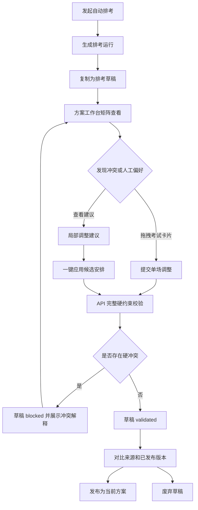
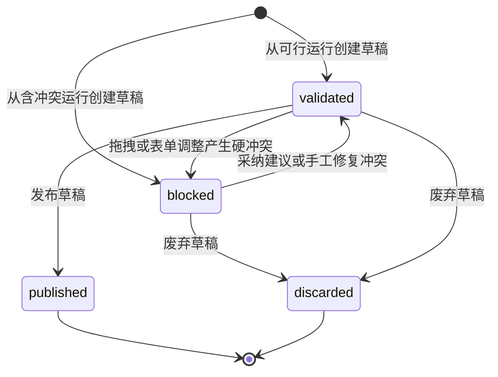

# 第二版人机协同排考报告素材

## 1. 流程说明

第二版将排考流程从“一次性自动生成结果”升级为“自动排考生成候选方案，人工在草稿中调整，系统实时校验硬约束，确认后发布”的人机协同闭环。

主要流程如下：

1. 运营人员发起排考运行，系统调用调度器生成可行方案。
2. 运营人员从某次运行创建排考草稿，草稿继承来源运行的全部考试安排。
3. 运营人员在方案工作台中按时间段和考场矩阵查看安排，选择单场考试并调整时间段、考场或监考教师。
4. 系统每次调整后重新执行硬约束校验，并将草稿状态更新为 `validated` 或 `blocked`。
5. 发布前系统展示草稿相对来源运行、当前已发布版本的变化数量，以及硬冲突数量、评分和最近调整记录。
6. 无硬冲突的草稿可以发布为当前正式方案；不再需要的草稿可以废弃，废弃后只保留审计与对比信息。
7. 发布后的正式方案可继续通过教师和学生群体维度查询。

## 2. 草稿状态迁移

草稿状态用于表达人工调整治理结果：

- `draft`：草稿刚创建或尚未完成校验的中间状态。
- `validated`：草稿通过硬约束校验，可以进入发布确认。
- `blocked`：草稿存在硬冲突，系统禁止发布。
- `published`：草稿已经发布为当前正式排考方案，后续禁止继续调整。
- `discarded`：草稿被人工废弃，后续禁止继续调整或发布。

当前实现中，草稿创建后会立即根据来源安排执行一次校验；每次人工调整也会重新校验并写入变更事件。`published` 和 `discarded` 是治理终态，用于避免同一草稿被重复修改、重复发布或误发布。

## 3. 硬约束校验策略

第二版草稿校验复用了调度器核心约束口径，并在 API 仓储层对人工调整后的完整安排重新计算硬冲突。当前覆盖的硬约束包括：

- 同一考场同一时间段只能安排一场考试。
- 同一学生群体同一时间段不能参加多场考试。
- 同一教师同一时间段不能监考多场考试。
- 教师不可用时间段不能安排监考。
- 考场容量必须满足考试人数。
- 考场类型必须满足考试任务要求。
- 考场设备必须满足考试任务要求。
- 考试任务如配置允许时间段，则只能安排在允许范围内。
- 每场考试监考教师数量必须满足要求。

发布接口在写入正式方案前会再次执行校验。即使前端按钮或中间状态异常，只要草稿存在硬冲突，API 仍会返回 `schedule_draft_has_conflicts` 并阻断发布。

## 4. 对比与发布确认

第二阶段补齐了发布确认需要的对比口径：

- 相对来源运行：用于说明人工调整对自动排考结果做了哪些改变。
- 相对当前发布版本：用于说明如果发布当前草稿，将替换掉哪些正式安排。
- 摘要指标：包括相对来源变化数、相对发布变化数、硬冲突数量和草稿评分。
- 最近调整记录：保留考试、调整前后安排、调整人和调整时间，支撑课程报告中的可追溯性说明。

发布确认面板不承担约束计算，只展示 API 返回的草稿事实，避免前端和后端约束口径分叉。

## 5. 测试结论

第二阶段 API 行为测试覆盖了以下核心路径：

- 草稿可与来源运行和当前发布版本分别对比。
- 草稿废弃后状态变为 `discarded`。
- 废弃草稿禁止继续调整。
- 废弃草稿禁止发布。
- 草稿废弃会写入 `schedule_draft.discarded` 审计事件。

真实 PostgreSQL 路径验证覆盖了以下核心路径：

- 从真实排考运行创建草稿。
- 通过人工调整制造硬冲突，草稿状态转为 `blocked`。
- 有硬冲突的草稿发布被 API 阻断。
- 恢复原安排后草稿重新变为 `validated`。
- 无硬冲突草稿可以发布，并更新当前发布版本。
- 已发布草稿禁止继续调整。
- 另一份草稿废弃后禁止发布。

## 6. 关键取舍

- 草稿调整采用“完整重校验”而不是局部增量校验。当前数据规模下实现更清晰，也能保证人工调整后的约束解释与调度器口径一致。
- 发布采用治理终态控制。`published` 和 `discarded` 草稿禁止继续修改，降低误操作和审计歧义。
- 前端先提供表单式矩阵工作台，不做拖拽式交互。这样能优先交付稳定的业务闭环，并保留后续升级空间。
- 当前发布确认展示变化数量和最近调整记录，不直接生成导出报告。课程报告材料先沉淀在文档中，后续如需要可扩展为系统导出功能。

## 7. 第三阶段增强流程图

第三阶段在第二阶段闭环上补充拖拽调整和局部调整建议。报告中可以使用以下 Mermaid 流程图说明人机协同过程：

## 8. 草稿状态图

草稿状态迁移可以用以下状态图表达：

`published` 和 `discarded` 是终态。终态草稿只保留审计、对比和查询价值，不允许继续调整或发布。

## 9. 第三阶段演示脚本

可用于课程答辩或录屏演示的步骤如下：

1. 打开运营台，确认基础数据、运行历史和已发布方案可读。
2. 发起一次自动排考运行，展示排考评分、冲突数量和安排数量。
3. 从该运行创建草稿，进入“方案工作台”。
4. 在时间段 × 考场矩阵中拖拽一张考试卡片到冲突位置，展示草稿转为 `blocked`，并展示硬冲突解释。
5. 选中该考试，查看“局部调整建议”面板，说明建议由 API 枚举候选安排并复用硬约束校验产生。
6. 点击“应用”采纳无硬冲突建议，展示草稿恢复 `validated`。
7. 查看发布确认面板，说明相对来源变化、相对发布变化、硬冲突数量和最近调整记录。
8. 发布草稿，进入已发布查询面板，按教师或学生群体查询最新正式安排。

## 10. 第三阶段测试结论摘要

第三阶段新增测试和验证材料可在报告中概括为：

- API 行为测试覆盖局部调整建议接口，验证系统可以为被人为制造冲突的单场考试返回无硬冲突候选安排。
- 建议应用仍复用原有草稿调整接口，因此所有建议都会经过同一套硬约束校验、状态迁移和变更事件记录。
- 前端拖拽只是提交 `PATCH /api/schedule-drafts/:id/assignments/:examTaskId`，不在浏览器端判断约束是否满足。
- 前端建议面板只展示 API 返回的候选安排、冲突数量、评分预估和解释，保持 Web/API/算法边界清晰。
